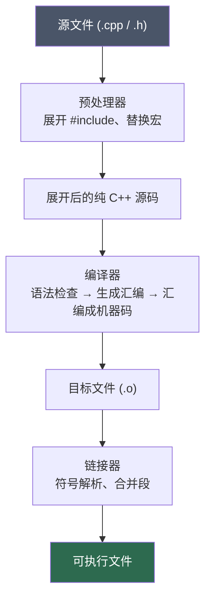

用 Python 或 Java 写程序，一般不需要关心"从源码到可执行文件"中间发生了什么。Python 解释器直接跑源码；Java 有 JVM 帮你搞定一切。但 C++ 不一样——它要经历一套完整的流程：预处理、编译、链接，最后才能跑起来。

这套流程并不复杂，但弄不清楚的话，遇到报错会完全不知道从哪儿查起。这篇文章就来把这个过程讲清楚。

## 全局视角

一个 C++ 程序从源码到运行，大致经过三个阶段：



每个阶段干的事情完全不同，报错的类型也完全不同。分清楚之后，看 CLion 的 Build Output 就会清晰很多。

## 第一阶段：预处理

预处理器是个文本处理工具，它不理解 C++ 语法，只负责处理以 `#` 开头的指令。

### `#include` 的本质

很多人以为 `#include <iostream>` 是某种特殊的"导入"机制。实际上它极其简单：**把对应文件的全部内容原样粘贴进来**。

`#include <iostream>` 就是把系统头文件目录里的 `iostream` 文件的全部文字复制进你的源文件。`#include "math.h"` 就是把当前目录的 `math.h` 复制进来。

不信的话可以用命令行验证。随便写一个 `main.cpp`：

```cpp
#include <iostream>

int main() {
    std::cout << "hello" << std::endl;
    return 0;
}
```

然后只做预处理，不编译：

```bash
clang++ -E main.cpp -o main.i
```

打开 `main.i`，你会看到几百上千行代码——那都是 `iostream` 被展开后的内容，你写的那五行只在最后几行。

这意味着你最终交给编译器的，是这个巨大的展开后的文本，而不是那五行原始代码。

### include guards 和 `#pragma once`

理解了 `#include` 是复制粘贴，一个问题就很自然地出现了：如果同一个头文件被包含两次，它的内容就会被粘贴两次。

假设 `math.h` 里声明了一个结构体：

```cpp
struct Vector2 {
    float x, y;
};
```

如果两个地方都 `#include "math.h"`，预处理完之后这个结构体定义就出现了两次，编译器会报 `redefinition of 'Vector2'`。

解决方式有两种，效果是一样的。

第一种是传统的 include guards：

```cpp
#ifndef MATH_H
#define MATH_H

struct Vector2 {
    float x, y;
};

#endif
```

第一次包含时，`MATH_H` 没有被定义，所以 `#ifndef` 成立，整个文件内容被处理，同时定义了 `MATH_H`；第二次包含时，`MATH_H` 已经存在，`#ifndef` 不成立，文件内容被跳过。

第二种是 `#pragma once`：

```cpp
#pragma once

struct Vector2 {
    float x, y;
};
```

效果完全相同，而且更简洁。`#pragma once` 告诉预处理器：这个文件只处理一次，不管它被 `#include` 多少次。

现代项目几乎都用 `#pragma once`，写起来不容易出错。

## 第二阶段：编译

预处理完成后，每个 `.cpp` 文件被独立送去编译。注意是**每个文件独立编译**，这是理解 C++ 编译模型的核心。

### Translation Unit

每个 `.cpp` 文件（加上它 `#include` 进来的所有内容）构成一个 translation unit（翻译单元）。编译器一次处理一个 translation unit，最终生成一个对应的目标文件 `.o`。

```
main.cpp     →  编译  →  main.o
math.cpp     →  编译  →  math.o
utils.cpp    →  编译  →  utils.o
```

关键点：**编译器在编译 `main.cpp` 时，完全不知道 `math.cpp` 的存在**。它只看 `main.cpp` 展开后的内容。

这带来一个直接影响：如果你在 `main.cpp` 里调用了一个函数，编译器必须至少看到这个函数的**声明**，不然它不知道这个函数的参数类型和返回类型，没法生成正确的调用代码。

但它不需要看到函数的**定义**（具体实现）。那是链接器的事。

### 编译错误

编译阶段产生的错误通常是语法错误、类型不匹配、用了未声明的名字等：

```
error: use of undeclared identifier 'add'
error: no matching function for call to 'foo'
```

这类错误会告诉你具体在哪个文件哪一行，定位很容易。

## 第三阶段：链接

编译完成后，所有 `.o` 文件被交给链接器。链接器把它们拼在一起，解决所有跨文件的引用，生成最终的可执行文件。

### 声明 vs 定义

这是 C++ 里一个非常基础但容易混淆的概念：

**声明（declaration）**：告诉编译器"这个函数存在，它长这样"。

```cpp
int add(int a, int b);
```

**定义（definition）**：提供函数的具体实现。

```cpp
int add(int a, int b) {
    return a + b;
}
```

编译器只需要声明就能编译调用代码。链接器需要找到定义，才能知道调用时跳到哪里执行。

### One Definition Rule

链接器有一条铁律：One Definition Rule（ODR）。每个符号（函数、全局变量等）在整个程序里只能有一个定义。声明可以出现任意多次，但定义只能有一个。

这也是为什么函数定义要放在 `.cpp` 文件里，而不是头文件里——头文件会被多个 `.cpp` 包含，如果定义放在头文件里，每个 `.cpp` 展开后都有一份定义，链接器就会报错：`duplicate symbol`。

### 链接错误

链接错误的典型形式是 `undefined reference` 或 `undefined symbol`：

```
undefined reference to `add(int, int)'
```

这个错误的意思是：编译器在某个文件里看到了 `add` 的声明，也编译了对它的调用，但链接器在所有 `.o` 文件里找不到 `add` 的定义。

常见原因：
- 忘了把实现文件加进 CMake 的 `add_executable`
- 函数声明和定义的签名不一致（参数类型或数量对不上）
- 该链接的库没有链接

## 完整的两文件例子

把上面的概念串起来，看一个具体的例子。

项目结构：

```text
my_project/
├── CMakeLists.txt
├── main.cpp
├── math.cpp
└── math.h
```

`math.h`——只有声明：

```cpp
#pragma once

int add(int a, int b);
int multiply(int a, int b);
```

`math.cpp`——只有定义：

```cpp
#include "math.h"

int add(int a, int b) {
    return a + b;
}

int multiply(int a, int b) {
    return a * b;
}
```

`main.cpp`——调用函数：

```cpp
#include <iostream>
#include "math.h"

int main() {
    std::cout << add(3, 4) << std::endl;
    std::cout << multiply(3, 4) << std::endl;
    return 0;
}
```

`CMakeLists.txt`：

```cmake
cmake_minimum_required(VERSION 3.20)
project(my_project CXX)

set(CMAKE_CXX_STANDARD 23)
set(CMAKE_CXX_STANDARD_REQUIRED ON)

add_executable(my_project
    main.cpp
    math.cpp
)
```

整个流程是这样的：

1. 预处理 `main.cpp`：把 `iostream` 和 `math.h` 的内容展开粘贴进来，`main.cpp` 现在知道 `add` 和 `multiply` 的声明。
2. 预处理 `math.cpp`：把 `math.h` 的内容展开粘贴进来。
3. 编译 `main.cpp` → `main.o`：编译器看到 `add(3, 4)` 的调用，查到声明，生成调用指令，但留下一个未解析的符号引用。
4. 编译 `math.cpp` → `math.o`：编译器生成 `add` 和 `multiply` 的实现代码。
5. 链接 `main.o` + `math.o` → `my_project`：链接器发现 `main.o` 里有对 `add` 的未解析引用，在 `math.o` 里找到了 `add` 的定义，连上。生成最终可执行文件。

为什么要把声明放头文件、定义放 `.cpp`？因为头文件会被多处 `#include`，如果放了定义，就违反了 ODR。`.cpp` 文件通常只被编译一次，放定义是安全的。

## `static` 关键字在文件级别的含义

`static` 这个关键字在 C++ 里有好几种含义，用在函数或全局变量前面、在文件作用域下，含义是：**这个符号只在当前文件内可见，不参与链接**。

举个例子，假设 `math.cpp` 有一个内部用的辅助函数：

```cpp
static int clamp(int val, int lo, int hi) {
    if (val < lo) return lo;
    if (val > hi) return hi;
    return val;
}

int add(int a, int b) {
    return clamp(a + b, -1000, 1000);
}
```

`clamp` 被标记为 `static`，链接器不会把它的符号暴露出去。其他文件即使声明了 `int clamp(int, int, int)` 也链接不到这里的实现。

这有两个好处：一是避免命名冲突（别的文件可以有自己的 `clamp`），二是明确表达"这个函数是实现细节，不是公开接口"。

## 在 CLion 里区分编译错误和链接错误

CLion 的 Build Output 面板（底部的 Build 标签页）会显示完整的构建日志。

编译错误通常长这样：

```
/path/to/main.cpp:5:5: error: use of undeclared identifier 'add'
    add(3, 4);
    ^
```

有明确的文件路径和行号，错误信息描述的是代码层面的问题。

链接错误通常长这样：

```
Undefined symbols for architecture arm64:
  "add(int, int)", referenced from:
      _main in main.cpp.o
ld: symbol(s) not found for architecture arm64
```

没有行号，主体是 `ld`（链接器）报的。错误说的是"我在所有 `.o` 文件里找不到这个符号"。

看到 `ld:` 开头或者 `undefined reference to` / `undefined symbol`，就说明问题在链接阶段，不要去代码里找语法错误——先检查 CMake 里是否把所有 `.cpp` 都加进去了。

---

理解这套流程之后，C++ 的很多"奇怪"行为会豁然开朗。为什么函数要先声明后使用？为什么头文件不能随便放定义？为什么忘了加 `.cpp` 文件会有那种报错？答案都在这里。
